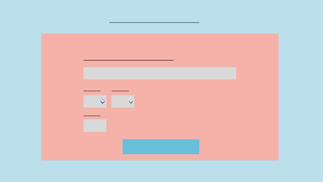

# Tarjeta de crédito válida

## Índice

* [1. Contexto de la página](#1-Contexto-de-pagina)
* [2. Prototipo](#2-prototipo)
* [3. Resumen del proyecto](#3-resumen-proyecto)
* [4. Validaciones implementadas](#4-validaciones-implementadas)
* [5. Producto final](#5-producto-final)

***

## 1. Contexto de la página

En México, el aumento de perros callejeros es un gran poblema, tratándose de alrededor de 25 millones de perros solo en la Ciudad de México.
La página web se basa en un albergue de perros, dedicado a rescatarlos y brindarles calidad de vida mediante alimento, vivienda y salud. Se encargan de la búsqueda de hogar para los perros mediante la adopción en la que los adoptantes sean responsables. Para solventar los gastos del albergue, este recibe donaciones del público en general.

## 2. Prototipo

Se generó el prototipo con Figma.

Inicialmente no se consideraron varios campos para la parte de la validación. A comparación del resultado final hubo una gran cantidad de cambios, como ejemplo, la paleta de colores y algunos elementos, así como sus posiciones.

## 3. Resumen del proyecto

En este proyecto se construyó una aplicación web que permite: 

* Validar un número de una tarjeta de crédito para realizar una donación.
* Ocultar todos los dígitos de una tarjeta menos los últimos cuatro.
* Mostrar a qué franquicia pertenece el número de tarjeta ingresado.

## 4. Validaciones implementadas

* Para el número de tarjeta se deben ingresar solo números en el campo de texto.
* Todos los campos deben estar llenos.

En caso de que no se cumplan los puntos anteriores, la validación del número de tarjeta no será ejecutada.

## 5. Producto final

Los mensajes se muestran con alert de JS, los cuales le indican al usuario si hacen falta campos por llenar, si la tarjeta es válida o no. 
Con este proyecto se trabajó de primera mano con la lógica de programación para la implementación de algoritmos, de acuerdo con los objetivos de aprendizaje, se lograron cumplir la mayoría. Así como la adición del CSS lo que me permitió comprender atributos básicos y su variedad de valores. 